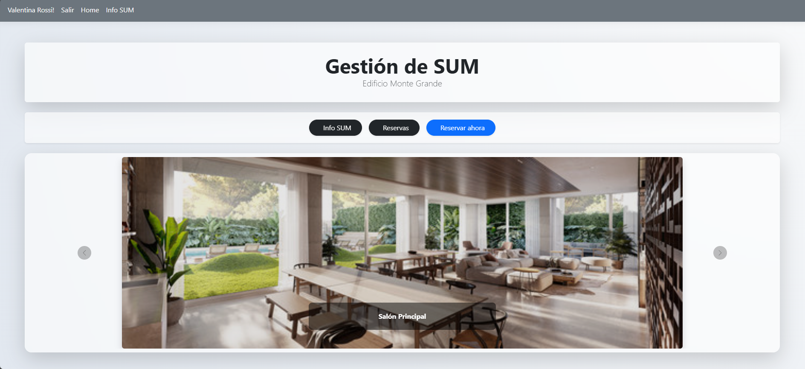
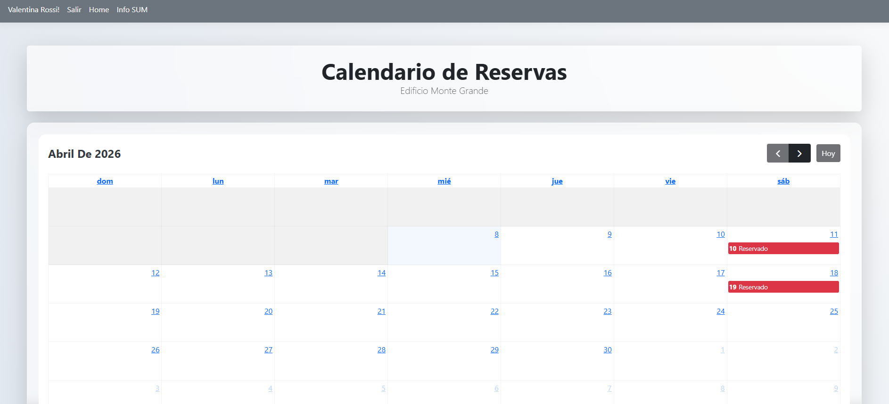
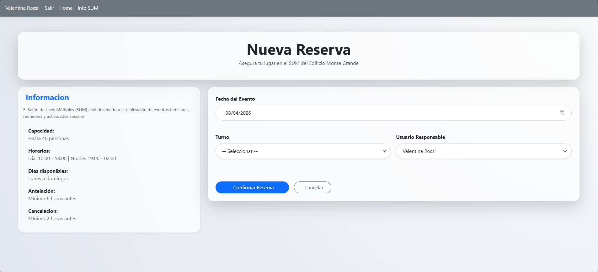
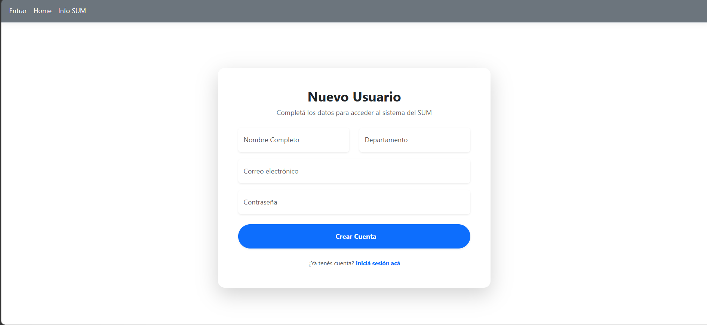

# 🏢 GestionSUM - Sistema de Reservas para Edificios


**GestionSUM** es una plataforma web Full Stack diseñada para simplificar la reserva de espacios comunes en complejos residenciales. Centraliza la disponibilidad en un calendario interactivo y automatiza la comunicación con los vecinos.

---

## 📸 Capturas de Pantalla

| Inicio  | Calendario Interactivo |
| :---: | :---: |
|  |  |

| Nueva Reserva | Registro de Usuarios |
| :---: | :---: |
|  |  |

---

## 🚀 Características Principales

- **Gestión de Roles Dinámica:** Control de acceso basado en roles (**Administradores** y **Vecinos**) mediante **ASP.NET Core Identity**.
- **Calendario Interactivo:** Visualización de disponibilidad en tiempo real integrada con la API de **FullCalendar**.
- **Notificaciones Transaccionales:** Envío automatizado de confirmaciones de reserva por email mediante **Brevo (SMTP Relay)** y **MailKit**, con plantillas HTML personalizadas.
- **Reglas de Negocio Automatizadas:**
  - Validación de anticipación mínima (6 horas).
  - Restricción de cancelación según políticas del edificio (2 horas de aviso previo).
  - Bloqueo de solapamientos de turnos y fechas pasadas.
- **Seguridad:** Implementación de **User Secrets** para el manejo seguro de credenciales de base de datos y API Keys de correo.

---

## 🛠️ Tecnologías Utilizadas

- **Backend:** C# / ASP.NET Core MVC 8.
- **ORM:** Entity Framework Core (Code First).
- **Base de Datos:** MySQL / MariaDB.
- **Frontend:** HTML5, CSS3 (Glassmorphism design), JS, Bootstrap 5.
- **Mailing:** Brevo (ex-Sendinblue), MailKit.

---

## 🔧 Configuración Local

1. **Clonar el repositorio:**
   ```bash
   git clone [https://github.com/tu-usuario/GestionSUM.git](https://github.com/tu-usuario/GestionSUM.git)

2. **Configurar Secretos (appsettings.json):**
   ```bash
      "ConnectionStrings": {
        "DefaultConnection": "server=localhost;database=sum_reservas;user=root;password=TU_PASSWORD;"
      }
      "EmailSettings": {
        "SmtpUser": "TU_USUARIO_BREVO",
        "SmtpPass": "TU_MASTER_PASSWORD"
      }

3. **Configurar la Base de Datos:**
    ```bash
   "ConnectionStrings": {
    "DefaultConnection": "server=localhost;database=sum_reservas;user=root;password=TU_PASSWORD;"
    }

4. **Ejecutar Migraciones:**
    ```bash
    Update-Database

5. **Ejecutar la Aplicación:**
    ```bash
    dotnet run


👤 Autor
Agustín Carabajal Systems Professional & Full Stack Developer
agustin.hcarabajal@gmail.com